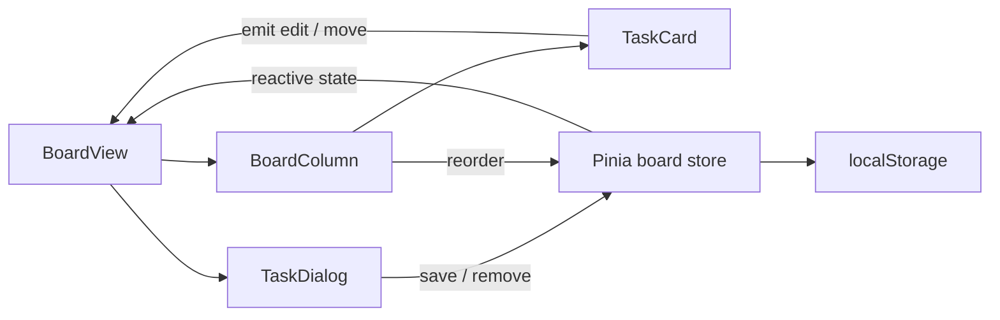

# Kiến trúc và lộ trình

Phạm vi sản phẩm và tiêu chí nghiệm thu nằm trong [Yêu cầu dự án](requirements.md). Bản hiện tại là M0 local. M1/M2/M3 dưới đây là mốc triển khai; MVP cộng tác hoàn thành ở M3, sau khi đạt các kịch bản nghiệm thu.

## Bản local hiện tại

Store là nguồn dữ liệu chung; form là bản nháp riêng. Component không ghi localStorage trực tiếp. Mỗi thao tác cập nhật xong gọi persist; lỗi lưu được hiển thị trên board. Chưa hỗ trợ nhiều tab cùng sửa: tab lưu sau có thể ghi đè tab trước.

## Vì sao tách các file

- `model.ts`: một định nghĩa Task cho UI, validation và storage. Khi thay schema, tăng phiên bản storage và viết migration.
- `storage.ts`: thay đổi nơi lưu không buộc sửa từng thẻ.
- `board.ts`: điều phối nghiệp vụ và quyền sở hữu state.
- `BoardColumn`: adapter giữa v-model của thư viện kéo thả và action store.
- `TaskDialog`: bản nháp, validation giao diện; Zod ở store là lớp kiểm tra cuối của bản local.
- `lib/supabase.ts`: điểm tích hợp có sẵn nhưng chưa thực thi auth/database.

## M1: lưu online và xác thực

Cách ly dữ liệu và RLS cơ bản phải có ngay ở M1; M2 mở rộng cho vai trò và lời mời. Supabase Auth; bảng profiles, workspaces, workspace_members, boards, columns, tasks. Một task thuộc một cột/board; API phải kiểm tra cột đích cùng board/workspace. `position` lưu thứ tự, không lấy index của danh sách đã lọc làm thứ tự database.

Chọn thứ tự số nguyên và một RPC transaction cho thao tác move ở MVP. Khi quy mô lớn hơn mới cân nhắc fractional rank. Đổi cột, cập nhật position và tăng version phải cùng transaction.

## M2: thành viên và phân quyền

Owner quản lý workspace và thành viên; Member sửa công việc; Viewer chỉ đọc. Dùng membership để viết RLS cho SELECT/INSERT/UPDATE/DELETE, kiểm tra cả trạng thái trước và sau UPDATE. Không tin workspace_id hoặc role từ frontend; không để người dùng tự nâng vai trò. Kiểm thử tài khoản A không thể đọc/sửa dữ liệu workspace B bằng request trực tiếp.

Lời mời cần email/người nhận, hạn dùng và trạng thái đã nhận. Không biến tên assignee của demo thành tài khoản thật một cách tự động.

## M3: realtime và nghiệm thu MVP

1. Client đọc snapshot board và subscribe vào board được phép.
2. Move gửi expectedVersion; server kiểm tra/cập nhật nguyên tử.
3. UI optimistic update; mỗi thao tác có ID để phân biệt event echo.
4. Nếu conflict hoặc thất bại, đối chiếu lại snapshot server, tránh rollback toàn board đè cập nhật mới của người khác.
5. Reconnect thì refetch. Realtime không tự giải quyết concurrent writes.
6. Đổi route hoặc unmount thì unsubscribe; kiểm tra user đã bị thu hồi quyền.

## Tài liệu chính thức

- https://vuejs.org/guide/introduction.html
- https://pinia.vuejs.org/core-concepts/
- https://github.com/SortableJS/vue.draggable.next
- https://reka-ui.com/docs/overview/introduction
- https://www.shadcn-vue.com/docs/introduction
- https://supabase.com/docs/guides/database/postgres/row-level-security
